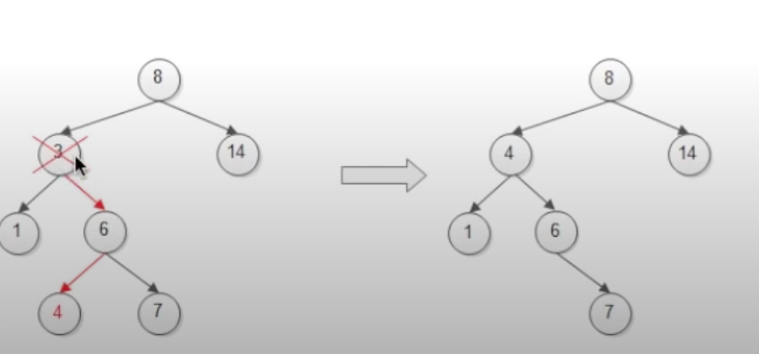

# Binary Search Tree


## when deleting Node:

    we have to go to the right node, and then go to the left most child-node of that right node, to make that the new node



```javascript
/* Binary Search Tree */

class Node {
  constructor(data, left = null, right = null) {
    this.data = data;
    this.left = left;
    this.right = right;
  }
}

class BST {
  constructor(initData) {
    this.root = null;
    if (Array.isArray(initData)) {
      initData.forEach(this.add.bind(this));
    }
  }

  // recursive function to search where to add new node
  searchTree(node, data) {
    // if data is less than out current node's data => go check left side
    if (data < node.data) {
      if (node.left === null) {
        // if there's nothing we can place
        node.left = new Node(data);
        return;
      } else if (node.left !== null) {
        // else make the root node.left and recurse
        return this.searchTree(node.left, data);
      }
    } else if (data > node.data) {
      // right side
      if (node.right === null) {
        node.right = new Node(data);
        return;
      } else if (node.right !== null) {
        return this.searchTree(node.right, data);
      }
    } else {
      return null;
    }
  }

  add(data) {
    const node = this.root;
    if (node === null) {
      // if no root node
      this.root = new Node(data);
      return;
    } else {
      return this.searchTree(node, data);
    }
  }

  findMin() {
    // if we look at the binary search tree, the min is always on the most bottom left, so we just keey traversing down left side
    let current = this.root;
    while (current.left !== null) {
      current = current.left;
    }
    return current.data;
  }

  findMax() {
    // Max is always on the most bottom right
    let current = this.root;
    while (current.right !== null) {
      current = current.right;
    }
    return current.data;
  }

  find(data) {
    // similar to is present
    let current = this.root;
    while (current.data !== data) {
      if (data < current.data) {
        current = current.left;
      } else {
        current = current.right;
      }
      if (current === null) {
        return null;
      }
    }
    return current; // returns the node where the data is
  }

  isPresent(data) {
    // this function is similar to find, but it returns true/false instead
    let current = this.root;
    while (current) {
      if (data === current.data) {
        // if our current equals to what we're looking for
        return true;
      }
      if (data < current.data) {
        // else compare their data val
        current = current.left;
      } else {
        current = current.right;
      }
    }
    return false; // return false at the end
  }

  remove(data) {
    const removeNode = function (node, data) {
      // here we define a function to remove node
      if (node == null) {
        // if we have an empty tree
        return null;
      }
      if (data == node.data) {
        // node has no children
        if (node.left == null && node.right == null) {
          return null; // returns nothing is the node has no children at all
        }
        // node has no left child
        if (node.left == null) {
          return node.right; // if we have no left child, replace it with our right child
        }
        // node has no right child
        if (node.right == null) {
          return node.left;
        }
        // node has two children
        var tempNode = node.right;
        while (tempNode.left !== null) {
          tempNode = tempNode.left; // find the most left child of the right tree
        }
        node.data = tempNode.data; // re-assign current node's data
        node.right = removeNode(node.right, tempNode.data); // call our function again to delete this node from the subtree
        return node;
      } else if (data < node.data) {
        // if our current node isnt equal to the data to be removed
        node.left = removeNode(node.left, data); // go to left / right according to comparison
        return node;
      } else {
        node.right = removeNode(node.right, data);
        return node;
      }
    };
    this.root = removeNode(this.root, data); // here we involk the function we defined & reassign the node to be deleted to what the function returns
  }

  isBalanced() {
    return this.findMinHeight() >= this.findMaxHeight() - 1;
  }

  findMinHeight(node = this.root) {
    if (node == null) {
      return -1;
    }
    let left = this.findMinHeight(node.left);
    let right = this.findMinHeight(node.right);
    if (left < right) {
      return left + 1;
    } else {
      return right + 1;
    }
  }

  findMaxHeight(node = this.root) {
    if (node == null) {
      return -1;
    }
    let left = this.findMaxHeight(node.left);
    let right = this.findMaxHeight(node.right);
    if (left > right) {
      return left + 1;
    } else {
      return right + 1;
    }
  }

  inOrder() {
    if (this.root == null) {
      return null;
    } else {
      var result = new Array();
      function traverseInOrder(node) {
        node.left && traverseInOrder(node.left);
        result.push(node.data);
        node.right && traverseInOrder(node.right);
      }
      traverseInOrder(this.root);
      return result;
    }
  }

  preOrder() {
    if (this.root == null) {
      return null;
    } else {
      var result = new Array();
      function traversePreOrder(node) {
        result.push(node.data);
        node.left && traversePreOrder(node.left);
        node.right && traversePreOrder(node.right);
      }
      traversePreOrder(this.root);
      return result;
    }
  }

  postOrder() {
    if (this.root == null) {
      return null;
    } else {
      var result = new Array();
      function traversePostOrder(node) {
        node.left && traversePostOrder(node.left);
        node.right && traversePostOrder(node.right);
        result.push(node.data);
      }
      traversePostOrder(this.root);
      return result;
    }
  }

  levelOrder() {
    let result = [];
    let Q = [];
    if (this.root != null) {
      Q.push(this.root);
      while (Q.length > 0) {
        let node = Q.shift();
        result.push(node.data);
        if (node.left != null) {
          Q.push(node.left);
        }
        if (node.right != null) {
          Q.push(node.right);
        }
      }
      return result;
    } else {
      return null;
    }
  }
}

const bst = new BST([9, 4, 17, 3, 6, 22, 5, 7, 20]);

console.log(bst.findMinHeight());
console.log(bst.findMaxHeight());
console.log(bst.isBalanced());
bst.add(10);
console.log(bst.findMinHeight());
console.log(bst.findMaxHeight());
console.log(bst.isBalanced());
console.log("inOrder: " + bst.inOrder());
console.log("preOrder: " + bst.preOrder());
console.log("postOrder: " + bst.postOrder());

console.log("levelOrder: " + bst.levelOrder());
```
